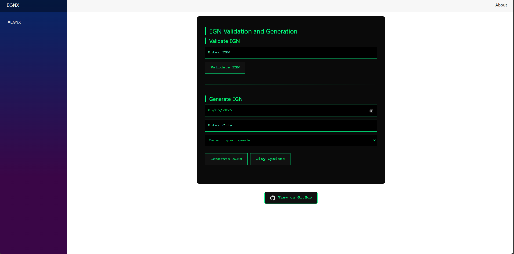

# 🧠 EGNX

**EGNX** is a Blazor WebAssembly app that lets you **validate** and **generate** Bulgarian EGNs (ЕГН) with a slick, dark, terminal-inspired UI.

## ⚙️ Features

- 🔐 **Validate** existing EGNs with instant feedback
- 🧬 **Generate** realistic EGNs based on birthdate, city, and gender
- 🕶️ Clean hacker-style dark UI with animated buttons
- 🧠 Built with Blazor WebAssembly — C# in the browser, no backend needed

## 🚀 Live Demo

[egnx.pages.dev](https://egnx.pages.dev)

## 🛠️ Tech Stack

- [Blazor WebAssembly](https://dotnet.microsoft.com/apps/aspnet/web-apps/blazor)
- HTML, CSS
- C# (No JavaScript needed!)
- Hosted on Cloudflare Pages

## 📸 Preview

## 🧾 License

MIT License — do whatever you want, just don’t sell it as your own.

---

Built by [Homophobia].
